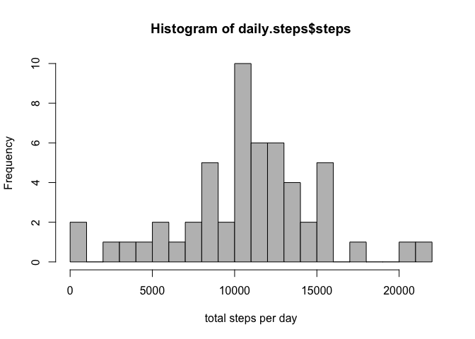
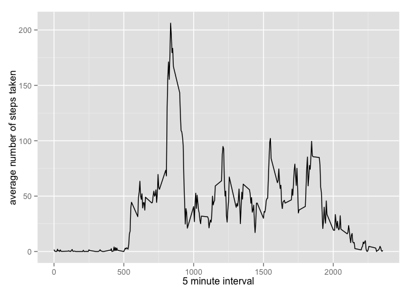
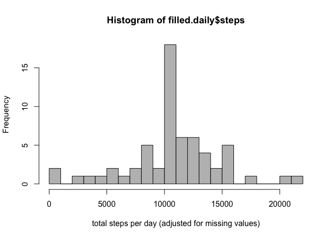
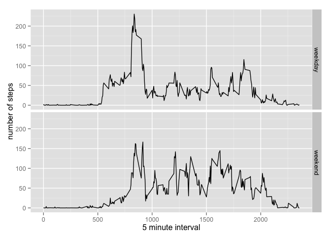

# Reproducible Research: Peer Assessment 1


## Loading and preprocessing the data

```r
unzip(zipfile="activity.zip")
activity.data <- read.csv("activity.csv")
activity.data$date <- as.Date(activity.data$date, "%Y-%m-%d")
```

## What is mean total number of steps taken per day?

```r
daily.steps <- aggregate(steps ~ date, data = activity.data[, 1:2], FUN=sum, na.rm = TRUE)
hist(daily.steps$steps, xlab = "total steps per day", col = "gray", breaks = 20)
```

 

```r
mean(daily.steps$steps, na.rm=TRUE)
```

```
## [1] 10766.19
```

```r
median(daily.steps$steps, na.rm=TRUE)
```

```
## [1] 10765
```

## What is the average daily activity pattern?

```r
library(ggplot2)
step.average <- aggregate(x = list(steps = activity.data$steps), 
                      by = list(interval = activity.data$interval), 
                      FUN = mean, na.rm = TRUE)
ggplot(data=step.average, aes(x=interval, y=steps)) +
    geom_line() +
    xlab("5 minute interval") +
    ylab("average number of steps taken")
```

 

Which 5-minute interval, on average across all the days in the dataset, contains the maximum number of steps?


```r
step.average[which.max(step.average$steps),]
```

```
##     interval    steps
## 104      835 206.1698
```

## Imputing missing values

Note that there are a number of days/intervals where there are missing values (coded as NA). The presence of missing days may introduce bias into some calculations or summaries of the data.


```r
# How many missing values
sum(is.na(activity.data$steps))
```

```
## [1] 2304
```

Fill any missing values with the mean for the 5-minute interval.


```r
# Replace each missing value with the mean value of its 5-minute interval
filled.activity.data <- activity.data
na.index <- which(is.na(activity.data$steps))
interval.index <- match(activity.data$interval[na.index], step.average$interval)
filled.activity.data$steps[na.index] <- step.average$steps[interval.index]
```

Make a histogram of the total number of steps taken each day and Calculate and report the mean and median total number of steps taken per day.


```r
filled.daily <- aggregate(steps ~ date, data = filled.activity.data[, 1:2], FUN=sum, na.rm = TRUE)
hist(filled.daily$steps, xlab = "total steps per day (adjusted for missing values)", col = "gray", breaks = 20)
```

 

```r
mean(filled.daily$steps, na.rm = TRUE)
```

```
## [1] 10766.19
```

```r
median(filled.daily$steps, na.rm = TRUE)
```

```
## [1] 10766.19
```

Mean and median values are higher after adjusting for missing values. Missing values are treated as zero 
steps by default and hence bring down the non-adjusted daily step count.

## Are there differences in activity patterns between weekdays and weekends?


```r
filled.activity.data$day.type <- factor(
  weekdays(filled.activity.data$date) %in% c("Saturday", "Sunday"), 
  labels = c("weekday", "weekend")
  )
```

Make a panel plot containing a time series plot (i.e. type = "l") of the 5-minute interval (x-axis) and the average number of steps taken, averaged across all weekday days or weekend days (y-axis).


```r
filled.step.average <- aggregate(steps ~ interval + day.type, data = filled.activity.data, mean)
ggplot(filled.step.average, aes(interval, steps)) + geom_line() + facet_grid(day.type ~ .) +
    xlab("5 minute interval") + ylab("number of steps")
```

 


